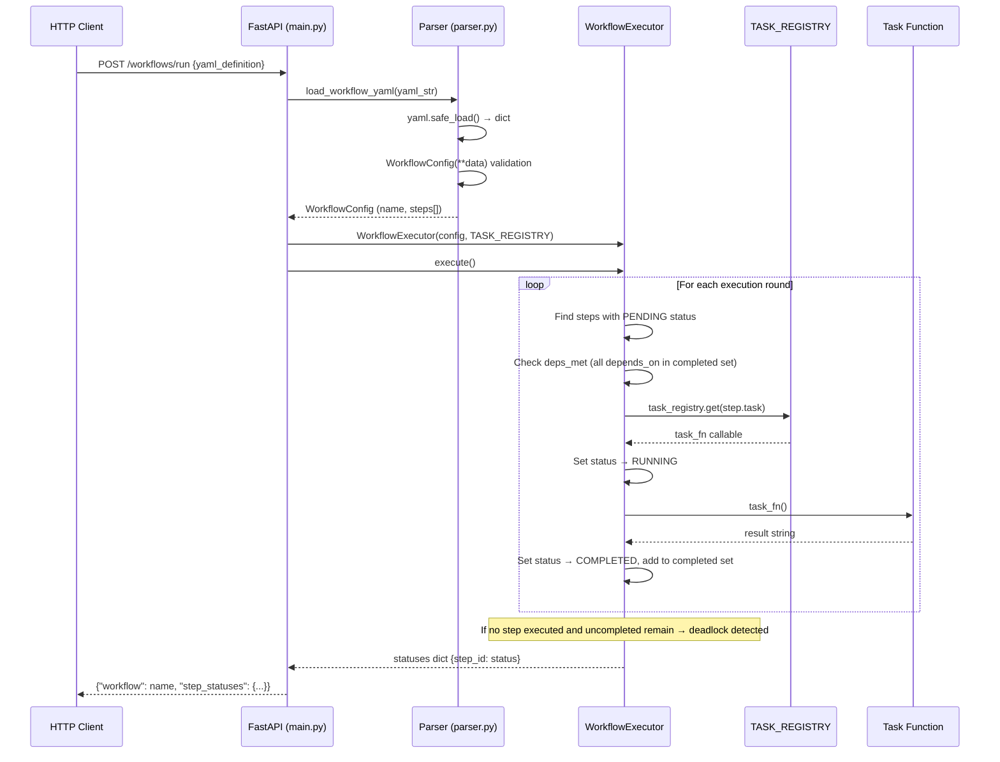
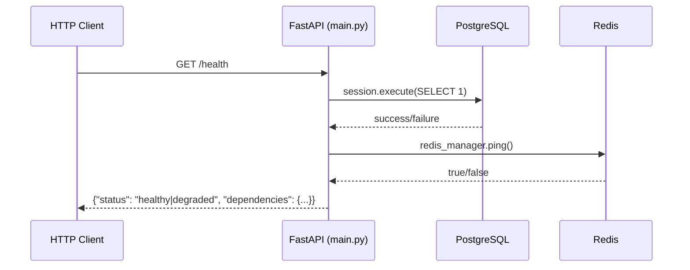
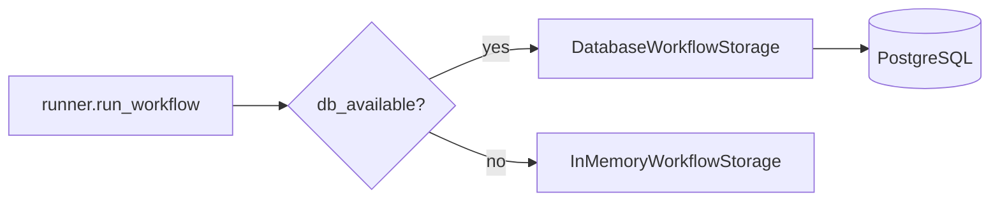
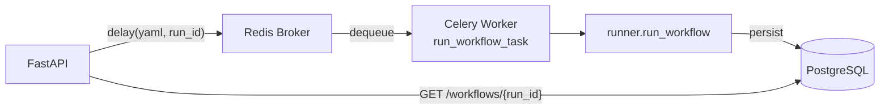
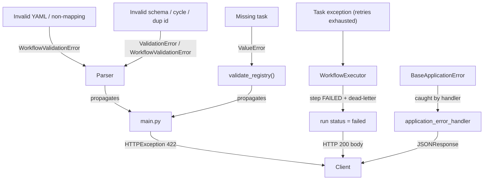

# Architecture — Async Workflow Engine

## System Overview

The Async Workflow Engine is a declarative workflow orchestration system that transforms YAML definitions into executable directed acyclic graphs (DAGs). Users submit workflow definitions via a FastAPI REST endpoint; the system parses the YAML into validated Pydantic models, resolves step dependencies in topological order, dispatches each step to a registered task function, and returns a per-step status map.

The engine is intentionally built from first principles—no Airflow, no Prefect—to demonstrate clear understanding of orchestration internals: dependency resolution, state machines, task dispatch, and failure detection.

## Component Map

| Module | Responsibility | Key Exports |
|--------|---------------|-------------|
| `main.py` | HTTP interface, all routes, dispatch (sync/Celery), storage selection | `app` (FastAPI) |
| `runner.py` | parse → execute → persist; shared by API + worker | `run_workflow()` |
| `parser.py` | YAML deserialization, schema validation, cycle detection | `WorkflowConfig`, `StepConfig`, `StepCondition`, `load_workflow_yaml()` |
| `executor.py` | DAG traversal, retries+backoff, branching, DLQ, `on_step` hook | `WorkflowExecutor` |
| `tasks.py` | Task implementations and registry | `TASK_REGISTRY`, `parse_text()`, `classify_with_llm()`, `send_notification()` |
| `scheduler.py` | Cron scheduling (croniter) | `WorkflowScheduler` |
| `webhooks.py` | Named webhook → workflow registry | `WebhookRegistry` |
| `dag.py` | `{nodes, edges, status}` projection for a UI | `build_dag()` |
| `db.py` | DB-availability probe + storage selection | `probe_database()`, `get_storage()` |
| `storage.py` | In-memory run persistence (no-DB fallback) | `InMemoryWorkflowStorage` |
| `storage_db.py` | PostgreSQL run persistence (default) | `DatabaseWorkflowStorage` |
| `models.py` | SQLAlchemy ORM models | `WorkflowRun`, `StepExecution` |
| `worker.py` | Celery app + real background workflow task | `celery_app`, `run_workflow_task()` |
| `config.py` | Project-specific configuration | `AppConfig` (extends `BaseAppConfig`) |
| `errors.py` | Structured error response handler | `application_error_handler()` |

### Shared Core Dependencies

Imported from `shared-core` (sibling library):

| Module | Used In | Purpose |
|--------|---------|---------|
| `shared_core.config.BaseAppConfig` | `config.py` | Base settings (`DATABASE_URL`, `REDIS_URL`, Celery, LLM keys) |
| `shared_core.database.DatabaseManager` | `db.py`, `main.py` | SQLAlchemy session factory + pooling |
| `shared_core.redis.RedisManager` | `main.py` | Redis wrapper with `ping()` health check |
| `shared_core.logging.setup_logging` | `main.py` | Loguru configuration with service tagging |
| `shared_core.errors` | `main.py`, `errors.py` | `BaseApplicationError` + `application_error_handler` |
| `shared_core.health.check_health` | `main.py` | DB + Redis health probe |
| `shared_core.tasks.create_celery_app` | `worker.py` | Celery app bootstrap |
| `shared_core.docparse.chunk_text` | `tasks.py` | Real text chunking in `parse_text` |
| `shared_core.llm.LLMClientFactory` | `tasks.py` | Real LLM path in `classify_with_llm` (when keyed) |
| `shared_core.testing.MockDatabase` | tests | In-memory SQLite for storage tests |

## Data Flow

### Workflow Execution (Primary Path)



### Health Check Path



## Execution Model

### DAG Resolution Algorithm

`WorkflowExecutor.execute()` implements a simple round-based topological sort:

1. Initialize all step statuses to `PENDING`
2. Enter main loop (continues while `len(completed) < len(steps)`)
3. Each round scans all steps:
   - Skip non-`PENDING` steps
   - Check if all `depends_on` step IDs are in the `resolved` set
   - If a `condition` is present and not satisfied by prior results → mark `SKIPPED` (resolved)
   - Otherwise set `RUNNING`, run the task with retries+backoff → `COMPLETED`, or `FAILED` + dead-letter on exhaustion
4. If a full round passes with no step resolved while uncompleted steps remain → no-progress break (a defense-in-depth guard; cycles are already rejected at parse time)
5. Return the final `statuses` dict (`overall_status` aggregates to completed/failed/partial)

This is an O(n²) algorithm in the worst case (n = number of steps), which is acceptable for workflows with dozens of steps. It does not require building an explicit adjacency list or performing a formal topological sort—the dependency check is inline.

### Step State Machine

```mermaid
stateDiagram-v2
    [*] --> PENDING: Step created
    PENDING --> SKIPPED: Condition not met
    PENDING --> RUNNING: Dependencies met, condition (if any) satisfied
    RUNNING --> COMPLETED: task returns
    RUNNING --> RUNNING: task raises, retries remain (backoff)
    RUNNING --> FAILED: retries exhausted -> dead-letter queue
    SKIPPED --> [*]
    FAILED --> [*]
    COMPLETED --> [*]

    note right of PENDING: Default state at WorkflowExecutor init
    note right of FAILED: Recorded in DLQ; independent branches continue
    note right of SKIPPED: Counts as resolved, no downstream deadlock
```



### Task Registry

`TASK_REGISTRY` in `tasks.py` maps string names to callables invoked as
`task_fn(context=..., params=...)`, where `context` holds prior step results and
`params` holds the step's declared parameters:

```python
TASK_REGISTRY = {
    "parse_text": parse_text,              # real text stats via shared_core.docparse
    "classify_with_llm": classify_with_llm,  # mock -> real LLM -> offline simulation
    "send_notification": send_notification,   # simulated dispatch
    "always_fail": always_fail,               # exercises retries / DLQ
}
```

The executor validates the registry up front (`validate_registry()` raises
`ValueError` listing any unknown task), then does a `dict.get()` lookup per step.

## Storage Model

PostgreSQL is the **default** backend; an in-memory store is the offline/test
fallback. `db.probe_database()` runs a cheap `SELECT 1` (2s connect timeout) at
startup and caches `db_available`; `get_storage()` then returns
`DatabaseWorkflowStorage` (SQLAlchemy) or `InMemoryWorkflowStorage`. Both expose
the same method surface (`save_run`, `get_run`, `list_runs`, `get_dead_letters`),
so the rest of the system is oblivious to which is active.



Schema (created by Alembic migration `0001_initial_schema`):

| Table | Columns | Purpose |
|-------|---------|---------|
| `workflow_runs` | `id`, `workflow_name`, `yaml_definition`, `status`, `started_at`, `completed_at`, `dead_letters` (JSON), `created_at`, `updated_at` | Run records; YAML stored to enable rerun |
| `step_executions` | `id`, `run_id` (FK), `step_id`, `task_name`, `status`, `result`, `error`, `attempt`, `created_at`, `updated_at` | Per-step execution history |

## Background Jobs

`worker.py` builds a Celery app via `shared_core.tasks.create_celery_app` and
defines `run_workflow_task`, which runs a **whole workflow** (probe → storage →
`runner.run_workflow`) in the background. It is importable with no broker
running, so the API and tests import it freely. Dispatch is opt-in
(`async_dispatch=true` on the request, or `WORKFLOW_ASYNC=1`); the default path
runs synchronously and needs no broker.



The same `runner.run_workflow()` powers both the synchronous API path and the
Celery worker, so the two can never diverge.

## External Dependencies

| Service | Required | Used By | Failure Behavior |
|---------|----------|---------|------------------|
| PostgreSQL 16 | Optional (default persistence) | run persistence, health | Probe fails fast → falls back to in-memory storage; health reports `"database": "offline"` |
| Redis 7 | Optional (async dispatch only) | Celery broker, health | Async dispatch unavailable; default sync path unaffected; health reports `"redis": "offline"` |

Both services are provisioned via `docker-compose.yml` with health checks (`pg_isready`, `redis-cli ping`).

## Failure Handling

### Error Propagation Chain



- **YAML / non-mapping:** `load_workflow_yaml` raises `WorkflowValidationError` → **422**.
- **Schema errors:** missing `name`, duplicate step ids, negative `retries` → Pydantic `ValidationError` → **422**.
- **Cycles / unknown deps:** `detect_cycles` raises `WorkflowValidationError` at parse time → **422**.
- **Registry misses:** `validate_registry()` raises `ValueError` before execution → **422**.
- **Task failures:** retried with backoff; on exhaustion the step is marked `FAILED`, recorded in the **dead-letter queue**, and the run completes with `status: "failed"` (**HTTP 200** — inspect the body, don't abort the run).
- **Infrastructure errors:** `BaseApplicationError` subclasses caught by the global `application_error_handler` → structured JSON.

## Security Boundaries

See [security.md](security.md) for detailed analysis. Key boundaries:

- **YAML parsing** uses `yaml.safe_load()` (not `yaml.load()`) to prevent arbitrary code execution
- **Task dispatch** is limited to functions registered in `TASK_REGISTRY` — user-submitted YAML cannot execute arbitrary code
- **Database credentials** are environment variables, not hardcoded
- **No authentication** on API endpoints (development mode)
