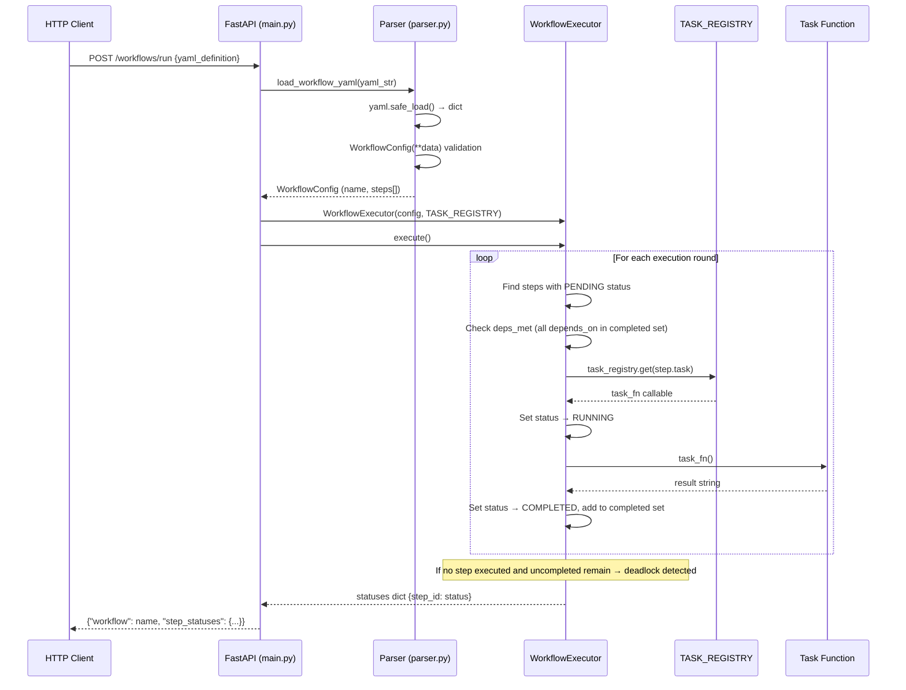
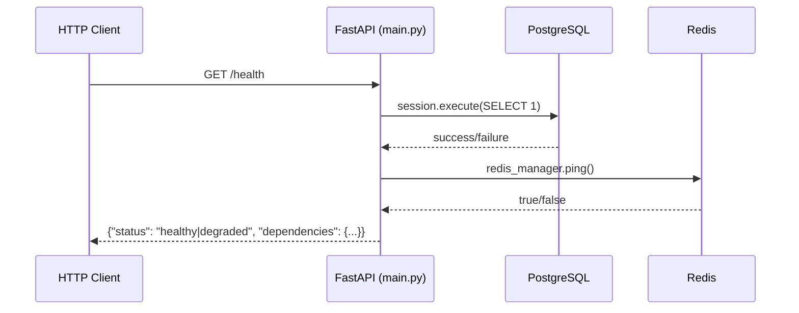
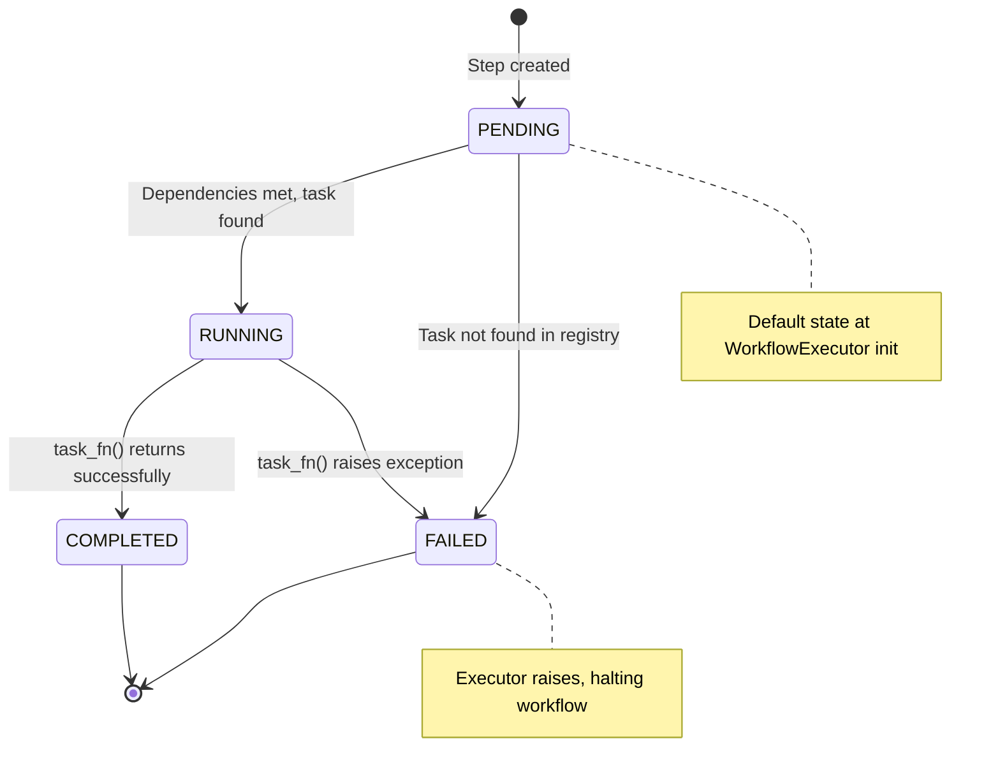
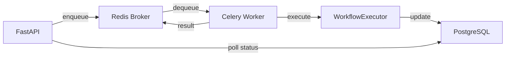
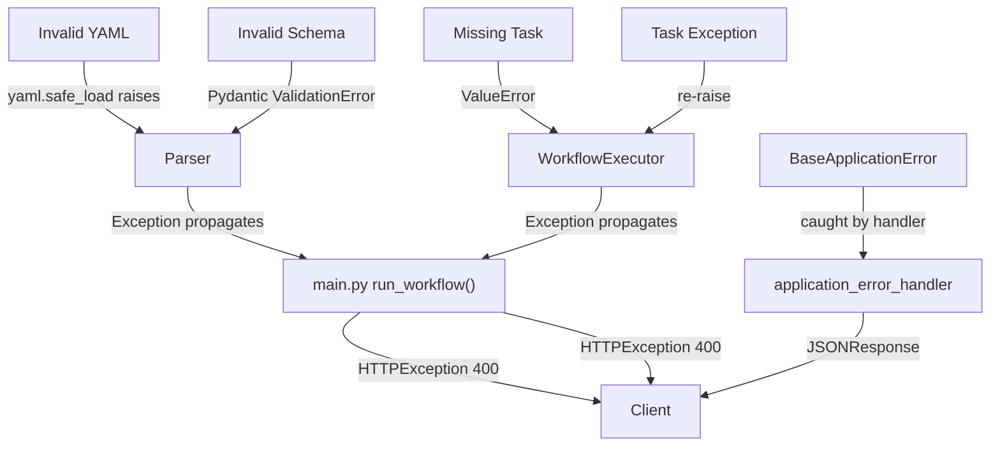

# Architecture — Async Workflow Engine

## System Overview

The Async Workflow Engine is a declarative workflow orchestration system that transforms YAML definitions into executable directed acyclic graphs (DAGs). Users submit workflow definitions via a FastAPI REST endpoint; the system parses the YAML into validated Pydantic models, resolves step dependencies in topological order, dispatches each step to a registered task function, and returns a per-step status map.

The engine is intentionally built from first principles—no Airflow, no Prefect—to demonstrate clear understanding of orchestration internals: dependency resolution, state machines, task dispatch, and failure detection.

## Component Map

| Module | Responsibility | Key Exports |
|--------|---------------|-------------|
| `main.py` | HTTP interface, dependency wiring, health checks | `app` (FastAPI), `run_workflow()`, `health_check()` |
| `parser.py` | YAML deserialization and schema validation | `WorkflowConfig`, `StepConfig`, `load_workflow_yaml()` |
| `executor.py` | DAG traversal, topological execution, deadlock detection | `WorkflowExecutor` |
| `tasks.py` | Task function definitions and registry | `TASK_REGISTRY`, `parse_text()`, `classify_with_llm()`, `send_notification()` |
| `storage.py` | Workflow run persistence (in-memory stub) | `InMemoryWorkflowStorage` |
| `worker.py` | Celery app and background task scaffold | `celery_app`, `sample_background_task()` |
| `config.py` | Project-specific configuration | `AppConfig` (extends `BaseAppConfig`) |
| `errors.py` | Structured error response handler | `application_error_handler()` |

### Shared Core Dependencies

Imported from `shared-core` (sibling library):

| Module | Used In | Purpose |
|--------|---------|---------|
| `shared_core.config.BaseAppConfig` | `config.py`, `worker.py` | Base settings with `DATABASE_URL`, `REDIS_URL`, `LOG_LEVEL` |
| `shared_core.database.DatabaseManager` | `main.py` | SQLAlchemy session factory and connection pooling |
| `shared_core.redis.RedisManager` | `main.py` | Redis connection wrapper with `ping()` health check |
| `shared_core.logging.setup_logging` | `main.py` | Loguru configuration with service name tagging |
| `shared_core.errors.BaseApplicationError` | `main.py`, `errors.py` | Base exception class with `status_code`, `code`, `message` |

## Data Flow

### Workflow Execution (Primary Path)



### Health Check Path



## Execution Model

### DAG Resolution Algorithm

`WorkflowExecutor.execute()` implements a simple round-based topological sort:

1. Initialize all step statuses to `PENDING`
2. Enter main loop (continues while `len(completed) < len(steps)`)
3. Each round scans all steps:
   - Skip non-`PENDING` steps
   - Check if all `depends_on` step IDs are in the `completed` set
   - If deps met: set `RUNNING`, look up task in registry, call it, set `COMPLETED`
4. If a full round passes with no step executed and uncompleted steps remain → **deadlock detected**, loop breaks
5. Return final `statuses` dict

This is an O(n²) algorithm in the worst case (n = number of steps), which is acceptable for workflows with dozens of steps. It does not require building an explicit adjacency list or performing a formal topological sort—the dependency check is inline.

### Step State Machine



### Task Registry

`TASK_REGISTRY` in `tasks.py` is a plain `Dict[str, Callable]` mapping string names to zero-argument functions:

```python
TASK_REGISTRY = {
    "parse_text": parse_text,          # → "metadata_parsed"
    "classify_with_llm": classify_with_llm,  # → "category_business"
    "send_notification": send_notification,   # → "notification_sent"
}
```

The executor does a `dict.get()` lookup. If the task name is not found, the step is marked `FAILED` and a `ValueError` is raised.

## Storage Model

### Current: In-Memory

`InMemoryWorkflowStorage` stores run records in a `Dict[str, Dict]`:

```python
{
    "run_id": {
        "workflow_name": "lead_intake",
        "statuses": {"parse_input": "COMPLETED", ...},
        "timestamp": "2026-06-08T17:00:00Z"  # hardcoded
    }
}
```

**Note:** This storage class exists but is not yet wired into `main.py` — the `/workflows/run` endpoint returns statuses directly from the executor without persisting them.

### Planned: PostgreSQL

Future schema (not yet implemented):

| Table | Columns | Purpose |
|-------|---------|---------|
| `workflow_runs` | `id`, `workflow_name`, `status`, `created_at`, `completed_at` | Top-level run records |
| `step_executions` | `id`, `run_id`, `step_id`, `task_name`, `status`, `result`, `error`, `started_at`, `completed_at`, `attempt` | Per-step execution history with retry tracking |
| `workflow_definitions` | `id`, `name`, `yaml_content`, `version`, `created_at` | Stored workflow templates |

## Background Jobs

### Current State

`worker.py` configures a Celery app using Redis as both broker and backend:

```python
celery_app = Celery(
    config.APP_NAME,
    broker=config.REDIS_URL,    # redis://localhost:6379/0
    backend=config.REDIS_URL
)
```

A single placeholder task `sample_background_task(x, y) → x + y` is defined. The Celery app is **not connected** to the `WorkflowExecutor`—all execution currently happens synchronously in the API request thread.

### Planned Architecture



The target model: API enqueues a workflow run ID, the Celery worker picks it up, runs the executor, and persists results. The API can then poll status via a `GET /workflows/{run_id}` endpoint.

## External Dependencies

| Service | Required | Used By | Failure Behavior |
|---------|----------|---------|------------------|
| PostgreSQL 16 | Yes (for health) | `main.py` health check, future persistence | Health reports `"database": "offline"`, API still functions |
| Redis 7 | Yes (for health + Celery) | `main.py` health check, `worker.py` broker | Health reports `"redis": "offline"`, Celery cannot start |

Both services are provisioned via `docker-compose.yml` with health checks (`pg_isready`, `redis-cli ping`).

## Failure Handling

### Error Propagation Chain



- **YAML errors:** `yaml.safe_load()` raises `yaml.YAMLError` → caught by `run_workflow()` → returns 400
- **Schema errors:** Pydantic `ValidationError` for missing `name`, invalid `steps` → caught → returns 400
- **Registry misses:** `ValueError(f"Task {step.task} missing")` → caught → returns 400
- **Task failures:** Any exception from `task_fn()` → step marked `FAILED` → re-raised → returns 400
- **Deadlock:** No exception raised; executor logs error and returns partial statuses with remaining steps stuck in `PENDING`
- **Infrastructure errors:** `BaseApplicationError` subclasses caught by global `application_error_handler` → structured JSON response

## Security Boundaries

See [security.md](security.md) for detailed analysis. Key boundaries:

- **YAML parsing** uses `yaml.safe_load()` (not `yaml.load()`) to prevent arbitrary code execution
- **Task dispatch** is limited to functions registered in `TASK_REGISTRY` — user-submitted YAML cannot execute arbitrary code
- **Database credentials** are environment variables, not hardcoded
- **No authentication** on API endpoints (development mode)
