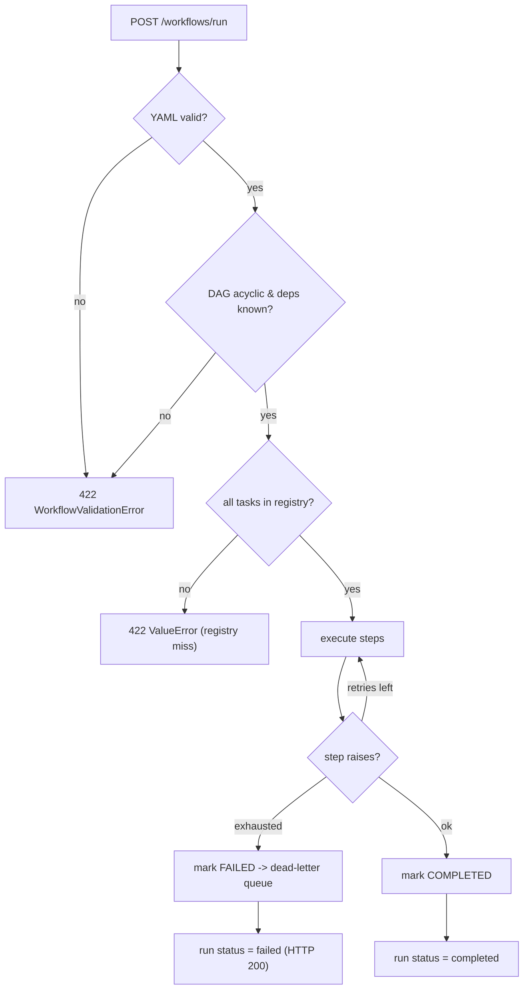

# Failure Modes & Mitigation

Predictable failure conditions in the Async Workflow Engine — how they manifest,
how they're detected, and how they're handled. This reflects the **implemented**
behavior, not aspirational future work.

## 1. Database Connectivity Failure

- **Cause**: PostgreSQL down, network partition, or pool exhaustion.
- **Impact**: At startup the probe (`db.probe_database`) fails within ~2s and the
  engine **falls back to in-memory storage** — the API keeps serving; runs
  execute and return normally but are not durable across restarts. `/health`
  reports `"database": "offline"`, `"status": "degraded"`, and `"storage":
  "in-memory"`.
- **Detection**: `GET /health` body; log line `Database unavailable (...) —
  falling back to in-memory storage.`
- **Mitigation**: `make docker-up` then restart the API to re-probe. `pool_pre_ping=True`
  (in `shared_core.database.DatabaseManager`) recovers stale connections.
- **Future**: periodic re-probe so the service upgrades to DB storage without a restart; `restart: unless-stopped` in compose.

## 2. Queue Backlog / Worker Starvation

- **Cause**: Spike in submissions, slow tasks (e.g. real LLM latency in
  `classify_with_llm`), or a Celery worker crash — only relevant when async
  dispatch is enabled (`async_dispatch=true` / `WORKFLOW_ASYNC=1`).
- **Impact**: Tasks queue in Redis; runs stay in their last persisted state.
- **Detection**: Redis `LLEN` on Celery queues; absent worker heartbeat;
  `task_track_started=True` and `task_time_limit=3600` are set in
  `shared_core.tasks.create_celery_app`.
- **Mitigation**: Tune `--concurrency`; the default sync path has no broker
  dependency at all.
- **Future**: Flower dashboard; soft time limits; autoscaling workers.

## 3. DAG Deadlock / Cyclic Dependencies

- **Cause**: A circular `depends_on` chain, or a condition that references a step
  forming a cycle.
- **Impact**: **Rejected at parse time.** `parser.detect_cycles` runs Kahn's
  algorithm over dependencies *and* implicit condition edges and raises
  `WorkflowValidationError` listing the unresolved nodes — the run never starts.
  The API returns 422.
- **Detection**: 422 with `Cycle detected in workflow DAG. Unresolved nodes:
  [...]`.
- **Mitigation**: Use `POST /workflows/validate` before submitting.
- **Residual**: A *runtime* deadlock is now structurally impossible for validated
  graphs; the executor still guards with a no-progress break as defense in depth.

## 4. Task Registry Miss

- **Cause**: A step references a task name not in `TASK_REGISTRY`.
- **Impact**: `WorkflowExecutor.validate_registry()` runs before execution and
  raises `ValueError` listing the missing tasks — nothing executes. API returns
  422. `POST /workflows/validate` catches it pre-flight.
- **Detection**: 422 with `Tasks not found in registry: ...`.
- **Mitigation**: `GET /tasks` lists every registered task for authors.

## 5. YAML Parse / Schema Errors

- **Cause**: Malformed YAML, a non-mapping document, missing `name`, duplicate
  step ids, or negative `retries`.
- **Impact**: `load_workflow_yaml` raises `WorkflowValidationError` (YAML/non-mapping)
  or Pydantic `ValidationError` (schema). API returns 422.
- **Detection**: 422 with the parser/validation message.
- **Mitigation**: `examples/sample_workflow.yaml` is a working reference;
  `POST /workflows/validate` validates without executing.

## 6. Task Function Exception (Retries + Dead-Letter Queue)

- **Cause**: A task raises (HTTP error, LLM timeout, bad input).
- **Impact**: The executor retries up to `step.retries` with exponential backoff
  (capped at `max_backoff`). On exhaustion the step is marked `FAILED`, its error
  is recorded, and an entry is appended to the **dead-letter queue**
  (task, error, attempts, params). Independent branches still run. The run
  completes with `overall_status = "failed"` (HTTP 200, not an exception).
- **Detection**: `GET /workflows/dead-letters` (all or `?run_id=`); log line
  `Step {id} failed after N attempts`.
- **Mitigation / Recovery**: Inspect the DLQ, fix the cause, then
  `POST /workflows/{run_id}/rerun` to re-execute the stored definition under the
  same run id.

## 7. Redis Connectivity Failure

- **Cause**: Redis down, port conflict on 6379, or memory exhaustion.
- **Impact**: `/health` reports `"redis": "offline"`. Async dispatch is
  unavailable; the **default synchronous path is unaffected** (no Redis needed).
- **Detection**: `GET /health`; `RedisManager.ping()` returns `False`.
- **Mitigation**: `make docker-up`; check port conflicts.

## 8. Concurrent Workflow Submissions

- **Cause**: Many simultaneous `POST /workflows/run` while running synchronously.
- **Impact**: Each request occupies a worker thread for the run's duration; slow
  tasks can saturate the pool.
- **Mitigation**: Enable async dispatch (`WORKFLOW_ASYNC=1` + a Celery worker) so
  the API returns a `task_id` immediately and execution happens off-thread; poll
  `GET /workflows/{run_id}`.

## 9. Scheduler / Webhook State Loss

- **Cause**: Process restart — `WorkflowScheduler` and `WebhookRegistry` are
  in-memory.
- **Impact**: Registered schedules and webhook triggers are lost (persisted
  *runs* are unaffected).
- **Mitigation**: Re-register on boot from config.
- **Future**: Persist both registries to PostgreSQL; drive schedules from Celery beat.
